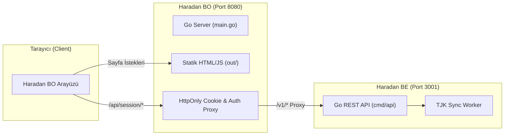

# 🏇 Haradan Backoffice (BO)

Next.js (SSG) ve Go (BFF Proxy) mimarisine sahip **Haradan.com Yönetim Paneli** tekil binary sunucu uygulaması.

---

## 📐 Sistem Mimarisi



---

## 🚀 Adım Adım Çalıştırma Rehberi

### 1️⃣ Backend (`haradan-be`) Servisini Başlatın
Backend'i **`3001`** portunda ve **`TJK_ENABLED=true`** parametresiyle çalıştırın:

```powershell
cd kartezya\haradan-be

# .env değişkenlerini yükle ve başlat
Get-Content .env | ForEach-Object { if ($_ -match "^\s*([^#=]+)\s*=\s*(.*)\s*$") { [System.Environment]::SetEnvironmentVariable($matches[1].Trim(), $matches[2].Trim()) } }
$env:HTTP_ADDR=":3001"
$env:TJK_ENABLED="true"
go run ./cmd/api
```

---

### 2️⃣ BO Sunucusunu (`haradan-bo`) Başlatın
Arayüzü derleyin ve Go proxy sunucusunu **`8080`** portunda çalıştırın:

```powershell
cd kartezya\haradan-bo

# Derle ve Başlat (Production / Binary Mode)
npm run build
go run main.go
```

> 🌐 **Erişim:** Tarayıcınızdan **`http://localhost:8080`** adresine gidin.

---

### 🛠️ Geliştirme (Development) Modu

Arayüz kodlarında canlı değişiklik yapmak istiyorsanız Next.js geliştirme sunucusunu kullanabilirsiniz:

```powershell
npm run dev
```

> ⚡ **Not:** `npm run dev` kullanırken de `go run main.go` (`8080`) ve `haradan-be` (`3001`) arkada çalışıyor olmalıdır.

---

## 🔑 Varsayılan Giriş Bilgileri

| Parametre | Değer |
| :--- | :--- |
| **E-posta** | `admin@kartezya.com` |
| **Şifre** | `haraa` |
| **Erişim Adresi** | `http://localhost:8080/login` |

---

## ⚙️ Yapılandırma & Detaylar

- **HttpOnly Cookie Yönetimi:** Access ve Refresh token'lar güvenli bir şekilde `main.go` tarafından cookie olarak tutulur.
- **TJK Senkronizasyon Adaptörü:** TJK senkronizasyonu başlatırken Kaynak Adaptörü olarak **`TJK_HTTP`** kullanılır.
- **Docker İle Çalıştırma:**
  ```bash
  docker build -t haradan-bo .
  docker run -p 8080:8080 haradan-bo
  ```
