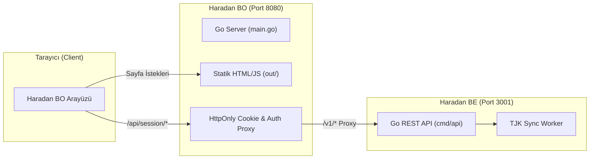

# 🏇 Haradan Backoffice (BO)

Next.js (SSG) ve Go (BFF Proxy) mimarisine sahip **Haradan.com Yönetim Paneli** tekil binary sunucu uygulaması.

---

## 📐 Sistem Mimarisi



---

## 🚀 Adım Adım Çalıştırma Rehberi

Projeyi yerelde eksiksiz çalıştırmak için sırasıyla aşağıdaki adımlar uygulanır:

### 1️⃣ Adım: Backend'i (`haradan-be`) Başlatma (Port 3001)

1. Terminalde (`haradan-be` dizininde):

```powershell
cd haradan-be
$env:HTTP_ADDR=":3001"
Get-Content .env | ForEach-Object { if ($_ -match '^([^=]+)=(.*)$' -and $matches[1].Trim() -ne 'HTTP_ADDR') { [System.Environment]::SetEnvironmentVariable($matches[1].Trim(), $matches[2].Trim(), 'Process') } }
go run ./cmd/api
```

eğer mac kullanıyorsan
...
export HTTP_ADDR=":3001"
set -a
source .env
set +a
export HTTP_ADDR=":3001"
go run ./cmd/api
...

*(Opsiyonel: TJK Senkronizasyonunu backend tarafında aktif etmek için `$env:TJK_ENABLED="true"` ekleyebilirsiniz.)*

---

### 2️⃣ Adım: BO Proxy Sunucusunu (`haradan-bo`) Başlatma (Port 8080)

2. Terminalde (`haradan-bo` dizininde):

```powershell
cd haradan-bo
$env:PORT="8080"
$env:BACKEND_API_URL="http://localhost:3001"
go run main.go
```

> 🌐 **Erişim Adresi:** Tarayıcınızdan **`http://localhost:8080`** adresine gidin.

---

### 🛠️ Geliştirme (Development) Modu (Opsiyonel)

Arayüz kodlarında canlı (hot-reload) değişiklik yapmak istiyorsanız Next.js dev sunucusunu da başlatabilirsiniz:

```powershell
cd haradan-bo
npm run dev
```

> ⚡ **Not:** `npm run dev` kullanıldığında da `go run main.go` (`8080`) ve `haradan-be` (`3001`) arkada çalışıyor olmalıdır. Uygulama ana erişim adresi **`http://localhost:8080`** üzerindendir.

---

## 🔑 Varsayılan Giriş Bilgileri

| Parametre | Değer |
| :--- | :--- |
| **E-posta** | `admin@kartezya.com` |
| **Şifre** | `haraa` |
| **Erişim Adresi** | `http://localhost:8080/login` |

---

## ⚙️ Yapılandırma & Detaylar

- **HttpOnly Cookie Yönetimi:** Access ve Refresh token'lar güvenli bir şekilde `main.go` tarafından cookie olarak tutulur.
- **TJK Senkronizasyon Adaptörü:** TJK senkronizasyonu başlatırken Kaynak Adaptörü olarak **`TJK_HTTP`** kullanılır.
- **Docker İle Çalıştırma:**
  ```bash
  docker build -t haradan-bo .
  docker run -p 8080:8080 haradan-bo
  ```
